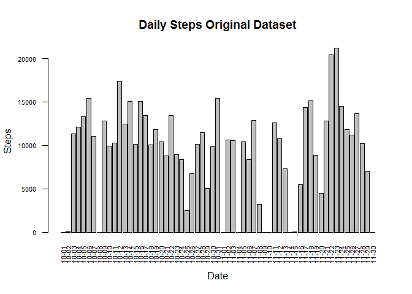
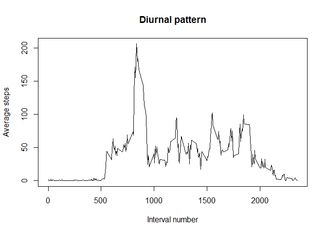
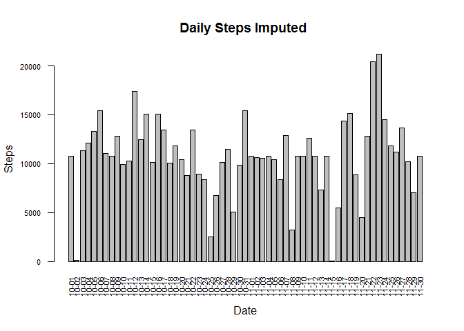
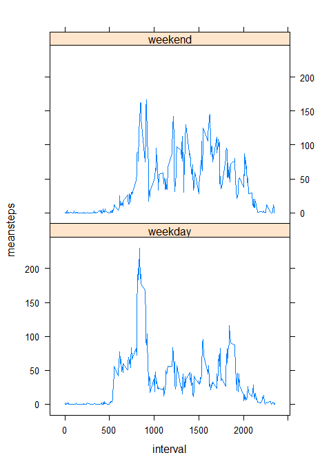
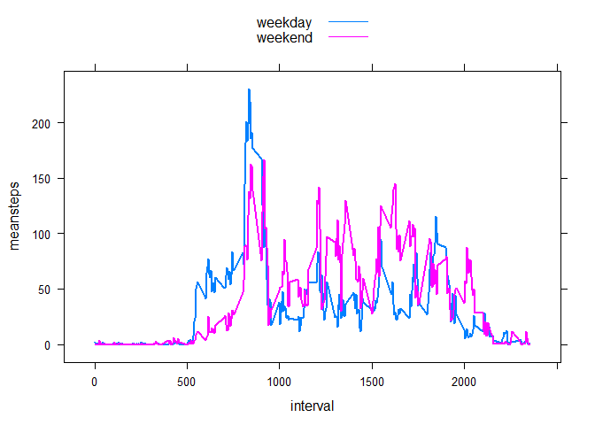

## 1. Loading and preprocessing the data


```r
temp <-tempfile()
download.file("https://d396qusza40orc.cloudfront.net/repdata%2Fdata%2Factivity.zip", temp)
actdata<-read.csv(unzip(temp),  header = TRUE)
unlink(temp)
rm(temp)
```
 Take a quick look at the data

```r
str(actdata)
```

```
## 'data.frame':	17568 obs. of  3 variables:
##  $ steps   : int  NA NA NA NA NA NA NA NA NA NA ...
##  $ date    : Factor w/ 61 levels "2012-10-01","2012-10-02",..: 1 1 1 1 1 1 1 1 1 1 ...
##  $ interval: int  0 5 10 15 20 25 30 35 40 45 ...
```
 Convert 'date' column to 'Date' type


```r
actdata$date<- as.Date(actdata$date, '%Y-%m-%d')
```
 Check the distribution of 'na' accross the data 

```r
naind<-apply(actdata,2, is.na)
natotal <-apply(naind,2,sum)
natotal
```

```
##    steps     date interval 
##     2304        0        0
```

```r
rm(naind)
```


## 2. What is mean total number of steps taken per day?

```r
library(dplyr)

dailyactivity <-summarize(group_by(actdata, date),totalsteps = sum(steps, na.rm = T) )
```


### Make a histogram of the total number of steps taken each day


```r
par(cex.axis = 0.7)
barplot(dailyactivity$totalsteps, names.arg =format(dailyactivity$date,format = "%m-%d"), main = 'Daily Steps Original Dataset', las=2,  xlab = "Date", ylab = 'Steps' )
```

<!-- -->

```r
dev.off()
```

```
## null device 
##           1
```

### Calculate and report the mean and median total number of steps taken per day


```r
dailysummary<-c(mean = mean(dailyactivity$totalsteps, na.rm = T), median =median(dailyactivity$totalsteps, na.rm = T))
dailysummary
```

```
##     mean   median 
##  9354.23 10395.00
```


## 3. What is the average daily activity pattern?
### Make a time series plot of the 5-minute interval and the average number of steps taken, averaged across all days 

```r
pattern<-summarize(group_by(actdata, interval),averagesteps = mean(steps, na.rm = T) )
plot(pattern$interval, pattern$averagesteps, type = 'l', main = "Diurnal pattern", ylab = "Average steps", xlab = "Interval number")
```

<!-- -->

### Which 5-minute interval, on average across all the days in the dataset, contains the maximum number of steps?

```r
maxinterval <- pattern$interval[ind =which(pattern$averagesteps ==max(pattern$averagesteps))]
maxinterval
```

```
## [1] 835
```


## 4. Imputing missing values

### Calculate and report the total number of missing values in the dataset (i.e. the total number of rows with NAs)
see part 1, variable 'natotal'

```r
natotal
```

```
##    steps     date interval 
##     2304        0        0
```

### Devise a strategy for filling in all of the missing values in the dataset.
Missing step values will be replaced with mean steps for corresponing 5-min interval

### Create a new dataset that is equal to the original dataset but with the missing data filled in.


```r
naninterval <-actdata$interval[ is.na(actdata$steps)]

stepsimp <- vector('numeric',length(naninterval))
for (i in 1:length(naninterval)){
  stepsimp[i]<-pattern$averagesteps[pattern$interval == naninterval[i]]
  
}

actdataimp <- actdata
actdataimp$steps[is.na(actdata$steps)]<-stepsimp
```
### Make a histogram of the total number of steps taken each day and calculate and report the mean and median total number of steps taken per day. 


```r
dailyactimp <-summarize(group_by(actdataimp, date),totalsteps = sum(steps) )

par(cex.axis = 0.7)
barplot(dailyactimp$totalsteps, names.arg =format(dailyactimp$date,format = "%m-%d"), main = 'Daily Steps Imputed ', las=2,  xlab = "Date", ylab = 'Steps'  )
```

<!-- -->

```r
dev.off()
```

```
## null device 
##           1
```

```r
dailysumimp<-c(mean = mean(dailyactimp$totalsteps), median =median(dailyactimp$totalsteps))
dailysumimp
```

```
##     mean   median 
## 10766.19 10766.19
```
### Do these values differ from the estimates from the first part of the assignment?What is the impact of imputing missing data on the estimates of the total daily number of steps?

Imputing missing data resulted in a modest (~ 15%)  increase in the estimate of mean daily steps, and almost did not change  the estimate of the median daily steps 


## 5. Are there differences in activity patterns between weekdays and weekends?
### Create a new factor variable in the dataset with two levels -- "weekday" and "weekend" indicating whether a given date is a weekday or weekend day.


```r
factorday<- factor(weekdays(actdataimp$date), levels =c('Monday','Tuesday', 'Wednesday',
                                                    'Thursday', 'Friday','Saturday','Sunday'), ordered = T)

levels(factorday)[1:5]<- 'weekday'
levels(factorday)[2:3]<- 'weekend'

actdataimp$factorday<-factorday
```
### Make a panel plot containing a time series plot (i.e. type = "l") of the 5-minute interval (x-axis) and the average number of steps taken, averaged across all weekday days or weekend days (y-axis).

```r
weekdayact <- summarize(actdataimp %>% group_by(interval, factorday),meansteps = mean(steps))

library(lattice)
xyplot(meansteps~ interval  | factorday, data = weekdayact, type='l')
```



It seems that on weekdays the activity is higher in first half of the interavals (day), while total number of steps in the second half is higher on weekends (see graph below)

```r
xyplot(meansteps~ interval, data = weekdayact, groups = factorday, type='l', lw = 2, 
       auto.key=list(columns=1,  lines = T, points = F))   
```

<!-- -->
